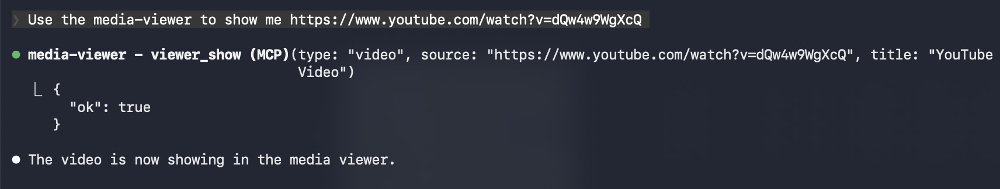
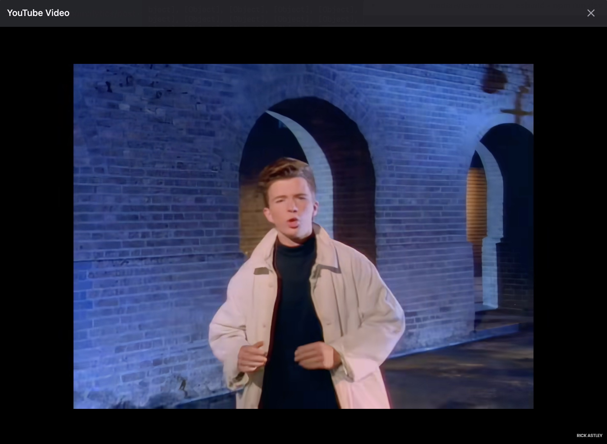

> ⚠️ **This is AI-generated code.** It is experimental and provided as-is. Use at your own risk.

# media-viewer-mcp

A chromeless Electron media viewer that AI coding agents can drive via MCP. Supports video (local, URLs, YouTube, Vimeo), PDF, Markdown, and plain text.

## Screenshots

**Ask the agent to show a video:**



**The viewer opens with the content:**



## Quick Start

```bash
npm install
npm run dev   # starts the Vite dev server (UI on :5174)
```

Wire it into Claude Code:

```bash
claude mcp add -s user media-viewer -- npx tsx /path/to/media-viewer-mcp/server/index.ts
```

## MCP Tools

### `viewer_show`
Opens or updates the viewer window. Non-blocking — returns immediately.

```json
{
  "type": "video" | "pdf" | "markdown" | "text",
  "source": "<file path, URL, or raw content>",
  "title": "Optional title"
}
```

- **video** — local file path, direct URL, YouTube, or Vimeo link
- **pdf** — local file path or URL
- **markdown** — raw markdown string
- **text** — raw text string

### `viewer_close`
Closes the viewer window.

## Architecture

```
Agent ──MCP──► server/index.ts ──WebSocket──► React UI (Electron window)
                                  :9998
```

1. Agent calls `viewer_show` → MCP server spawns Electron (if not open)
2. React UI sends a `ready` ping over WebSocket once mounted
3. Server fires the render command, UI displays the content
4. Window stays open until the user closes it or `viewer_close` is called

## Scripts

- `npm run dev` — Start the Vite dev server (`:5174`)
- `npm run build` — Build UI and compile server
- `npm start` — Run the compiled MCP server
